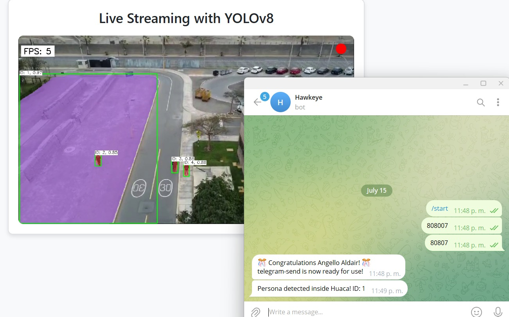

# HAWKEYE 🦅

**AI Surveillance System for Person Detection Using Drones**

This system performs person detection using the YOLOv8 deep learning model and provides real-time alerts via Telegram.

## 🌟 Key Features

*   **Person Detection**: Uses the YOLOv8 model for fast and precise inference.
*   **Interest Zone Segmentation**: Automatic detection of the "Huaca Zone" (purple color) to filter alerts.
*   **Instant Alerts**: Integration with Telegram Bot to notify of intrusions in the protected zone.
*   **Modern Web Interface**: Visual dashboard developed with Flask for real-time monitoring.

## 📸 Web Dashboard



*Above: Dashboard View (Illustrative)*

## ️ Installation and Usage

1.  **Requirements**: Python 3.8+
2.  **Install dependencies**:
    ```bash
    pip install flask ultralytics opencv-python requests
    ```
3.  **Configuration**:
    *   Open `src/camera.py` and configure `YOUR_TELEGRAM_TOKEN` and `YOUR_CHAT_ID`. (Note: File structure was refactored)
    *   Ensure a webcam is connected (or modify `0` to the video path).
4.  **Execution**:
    ```bash
    python app.py
    ```

## 📂 Project Structure

*   `app.py`: Flask Web Server.
*   `src/camera.py`: Main video logic and orchestration.
*   `src/detector.py`: YOLOv8 inference module.
*   `src/segmenter.py`: Computer vision algorithm to detect the purple zone.
*   `src/telegram_bot.py`: Messaging service.
*   `templates/`: HTML files for the interface.
*   `config/`: Configuration files.
*   `static/`: Assets and images.

---
